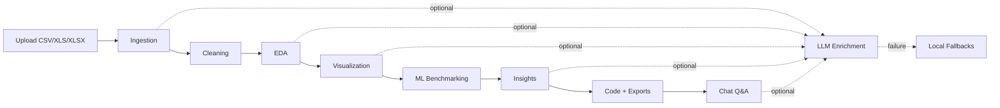

<p align="center">
  
</p>

<h1 align="center">INFORGE-AI</h1>

<p align="center">
  <strong>Autonomous multi-agent analytics for CSV and Excel datasets.</strong>
</p>

<p align="center">
  
  
  
  
  
</p>

<p align="center">
  
  
  
  
</p>

Autonomous multi-agent analytics platform for turning raw CSV and Excel datasets into cleaned data, exploratory analysis, visualizations, machine learning benchmarks, business insights, exports, and conversational Q&A.

INFORGE-AI is designed so the core analytical workflow remains useful even when external LLM providers are unavailable. The backend computes schema diagnostics, cleaning, EDA, visualizations, model training, metrics, and exports locally, then uses LLMs to enrich the user-facing explanations when valid provider credentials are available.

## Navigation

| Section | What you get |
|---|---|
| [What The System Does](#-what-the-system-does) | End-user capability overview |
| [Architecture](#-architecture) | System shape and agent flow |
| [Local Development](#-local-development) | Backend and frontend setup |
| [API Reference](#-api-reference) | Upload, results, chat, exports |
| [Pipeline Details](#-pipeline-details) | Agent-by-agent behavior |
| [Reliability Behavior](#-reliability-behavior) | LLM fallback guarantees |
| [Troubleshooting](#-troubleshooting) | Common failure paths |

## ✨ What The System Does

Upload a dataset and the platform runs a full analysis pipeline:

| Icon | Capability | Result |
|---:|---|---|
| 🧭 | Schema intelligence | Detects data types, dimensions, sample rows, and a likely modeling target |
| 🧹 | Data cleaning | Handles duplicates, missing values, high-missing columns, and quality issues |
| 📊 | EDA | Computes statistics, skewness, categorical counts, correlations, and flags |
| 🎨 | Visualization | Builds heatmaps, distributions, box plots, bar charts, and scatter plots |
| 🤖 | ML benchmarking | Detects classification, regression, or clustering and compares models |
| 💡 | Business insights | Produces summaries, recommendations, reports, and reproducible code |
| 💬 | Contextual chat | Answers follow-up questions using the completed analysis context |

## 🧱 Architecture

```text
React + Vite frontend
        |
        | REST + WebSocket
        v
FastAPI backend
        |
        v
Pipeline orchestrator
        |
        +-- Ingestion agent
        +-- Cleaning agent
        +-- EDA agent
        +-- Visualization agent
        +-- ML agent
        +-- Insights agent
        +-- Code generation agent
        +-- Chat agent
        |
        v
Local analytics engine + optional LLM enrichment
```

The analytical foundation is local and deterministic. LLM calls are used for richer prose, recommendations, chart strategy, generated code, and conversational responses. If OpenRouter, Groq, or Gemini fails because of an invalid key, unavailable model, rate limit, or network issue, the system falls back to local heuristics so the pipeline can still complete.

<details>
<summary><strong>Open pipeline flow</strong></summary>



</details>

## 🧰 Tech Stack

Backend:

| Layer | Tools |
|---|---|
| API | FastAPI, Uvicorn, WebSockets |
| Data | pandas, NumPy |
| ML | scikit-learn, XGBoost |
| Charts & reports | Matplotlib, Seaborn, ReportLab |
| Integrations | httpx, python-dotenv |

Frontend:

| Layer | Tools |
|---|---|
| App runtime | React 19, Vite |
| UI | Tailwind CSS, Lucide React |
| Motion | Framer Motion |
| Charts | Recharts |

Optional AI providers:

- OpenRouter-compatible chat models for schema/EDA enrichment
- Groq chat models for insight, code, and chat enrichment
- Gemini for visualization strategy fallback
- Local fallback heuristics when providers are unavailable

## 📁 Repository Layout

```text
INFORGE-AI/
├── backend/
│   ├── agents/
│   ├── pipeline/
│   ├── utils/
│   ├── main.py
│   ├── requirements.txt
│   ├── test_pipeline.py
│   └── test_run.py
├── frontend/
│   ├── public/
│   ├── src/
│   ├── package.json
│   └── vite.config.js
├── Dockerfile
├── .gitignore
└── README.md
```

## ⚙️ Local Development

### 1. Clone

```bash
git clone https://github.com/vinayak533/InForge-AI.git
cd InForge-AI
```

### 2. Backend

Create the Python environment at the repository root:

```bash
python -m venv venv
```

Install backend dependencies:

```bash
cd backend

# Windows
..\venv\Scripts\activate

# macOS/Linux
source ../venv/bin/activate

pip install -r requirements.txt
python main.py
```

Backend runs at:

```text
http://localhost:8000
```

API docs are available at:

```text
http://localhost:8000/docs
```

### 3. Frontend

In a second terminal:

```bash
cd frontend
npm install
npm run dev
```

Frontend dev server runs at:

```text
http://localhost:5173
```

During Vite development, the frontend calls the backend at `http://localhost:8000`.

## 🚀 Single-Port Preview

For a simple local preview where FastAPI serves the built React app:

```bash
cd frontend
npm install
npm run build

cd ../backend
../venv/Scripts/python.exe main.py
```

Open:

```text
http://localhost:8000/index.html
```

On macOS/Linux, use:

```bash
../venv/bin/python main.py
```

## 🔐 Environment Variables

Create `backend/.env` if you want LLM-enriched responses:

```env
GEMINI_API_KEY=your_gemini_key
GROQ_API_KEY=your_groq_key
OPENROUTER_API_KEY=your_openrouter_key
```

These keys are optional for the core analytics workflow. Without valid keys, INFORGE-AI still runs local ingestion, cleaning, EDA, visualization, ML benchmarking, fallback insight generation, fallback code generation, and chat answers grounded in computed results.

## 🔌 API Reference

| Endpoint | Method | Description |
|---|---:|---|
| `/` | GET | Backend health check |
| `/upload` | POST | Upload a CSV, XLS, or XLSX dataset and start analysis |
| `/ws/{session_id}` | WebSocket | Stream real-time pipeline progress |
| `/results/{session_id}` | GET | Retrieve completed analysis results |
| `/chat/{session_id}` | POST | Ask questions about a completed analysis |
| `/export/csv/{session_id}` | GET | Download cleaned CSV output |
| `/export/pdf/{session_id}` | GET | Download PDF analysis report |

Example chat request:

```bash
curl -X POST "http://localhost:8000/chat/<session_id>" \
  -H "Content-Type: application/json" \
  -d "{\"message\":\"What is the best model and why?\"}"
```

<details>
<summary><strong>Open API lifecycle</strong></summary>

```text
POST /upload
  -> returns session_id
  -> backend starts pipeline in the background

WS /ws/{session_id}
  -> streams agent progress to the dashboard

GET /results/{session_id}
  -> returns processing, failed, or completed results

POST /chat/{session_id}
  -> answers only after the session is completed
```

</details>

## 🧠 Pipeline Details

### Ingestion

Extracts row/column counts, sample rows, missing values, unique counts, inferred data types, and a likely prediction target. If LLM schema enrichment fails, deterministic heuristics classify columns locally.

### Cleaning

Detects duplicates, null counts, high-missing columns, and numeric outliers. Applies safe imputation and duplicate removal while protecting the detected target column from accidental removal.

### EDA

Computes descriptive statistics, categorical counts, correlation matrices, top correlated pairs, skewed columns, and zero-variance flags. Local fallback summaries are generated when LLM EDA prose is unavailable.

### Visualization

Generates standard charts and recommended charts from either LLM strategy or local column/correlation heuristics.

### Machine Learning

Automatically selects a task type and benchmarks suitable models:

- Classification: Logistic Regression, Random Forest, XGBoost, KNN
- Regression: Linear Regression, Ridge Regression, Random Forest Regressor, XGBoost Regressor
- Clustering: K-Means, DBSCAN

The best model is selected using the appropriate metric for the detected task.

### Insights And Chat

The insights and chat layers use LLMs when available. If provider calls fail, they answer from the computed pipeline context, including model metrics, correlations, cleaning actions, recommendations, and dataset dimensions.

## 🛡️ Reliability Behavior

INFORGE-AI intentionally separates analytical correctness from LLM availability:

- Local analytics remain the source of truth.
- LLM failures do not abort the pipeline.
- Provider errors are logged and replaced with deterministic fallbacks.
- Chat answers remain available after successful analysis completion.
- Old failed sessions should be re-uploaded because uploaded file bytes are not persisted after failure.

## 🌐 Deployment

Typical deployment split:

| Component | Recommended targets |
|---|---|
| Frontend | Vercel, Netlify, static hosting |
| Backend | Hugging Face Spaces, Railway, Render, AWS EC2, Docker-compatible platforms |

For hosted frontend deployments, configure:

```env
VITE_API_BASE_URL=https://your-backend-host
VITE_WS_URL=wss://your-backend-host
```

## 🧯 Troubleshooting

<details>
<summary><strong>Chat says the session is still processing</strong></summary>

The chat endpoint only works after the analysis status is `completed`. Check:

```text
GET /results/{session_id}
```

</details>

<details>
<summary><strong>The pipeline previously failed</strong></summary>

Refresh the app and upload the dataset again. Failed in-memory sessions cannot be resumed after a backend restart or unrecoverable processing failure.

</details>

<details>
<summary><strong>LLM provider errors appear in logs</strong></summary>

The app can still complete using fallback logic. To enable enriched prose, confirm the keys in `backend/.env` and verify that the configured provider models are available to your account.

</details>

<details>
<summary><strong>Frontend cannot reach backend</strong></summary>

Make sure FastAPI is running on port `8000`. In Vite dev mode, the frontend defaults to:

```text
http://localhost:8000
```

</details>

## 📦 Exports

- Cleaned CSV dataset
- PDF analysis report
- Reproducible Python analysis script

## 🗺️ Roadmap

- Multi-user workspaces
- Persistent session storage
- Dataset versioning
- Scheduled analytics workflows
- Cloud warehouse connectors
- Domain-specific model recommendations

## 👤 Author

Vinayak K V  
Data Science and AI Engineer  

GitHub: [github.com/vinayak533](https://github.com/vinayak533)

## 📄 License

MIT License
